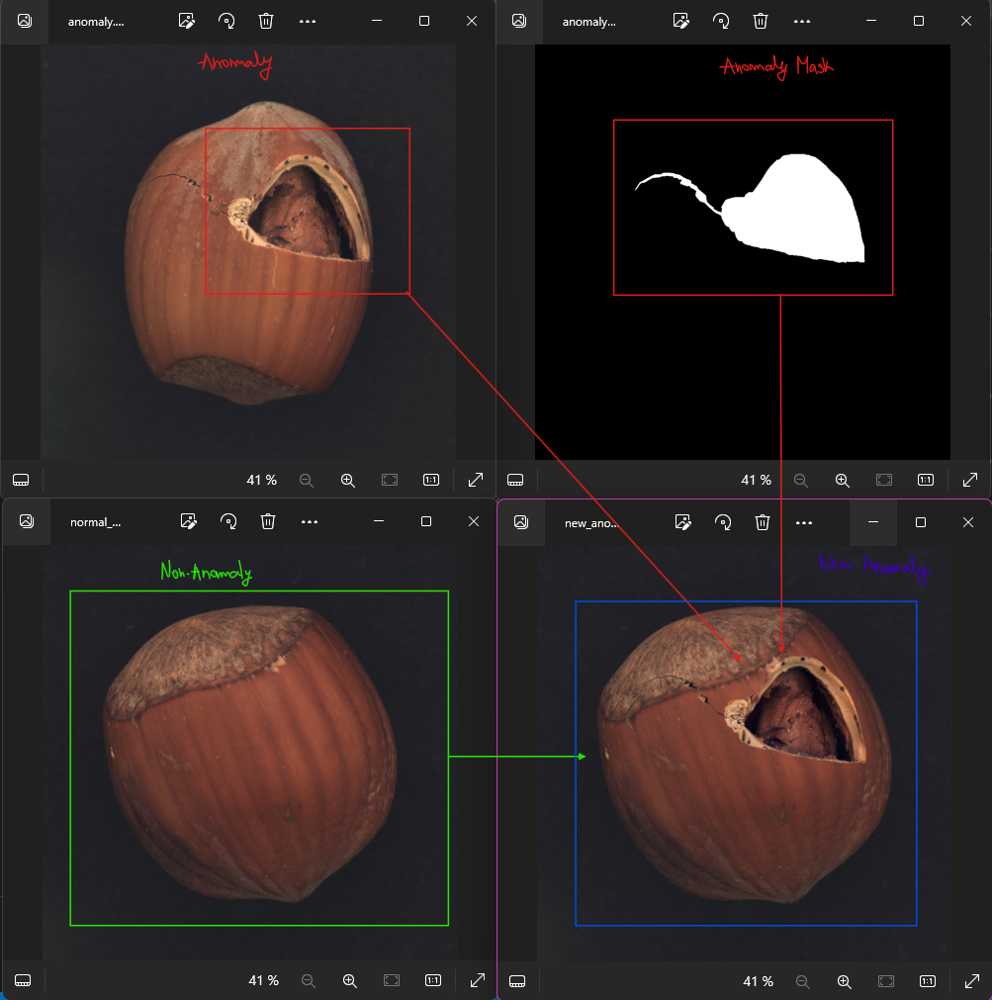

# Poisson Image Editing

This is a Python implementation of the [Poisson Image Editing]([https://www.cs.virginia.edu/~connelly/class/2014/comp_photo/proj2/poisson.pdf](https://github.com/Pablo-Molla-Charlez/Poisson_Image_Editing/blob/master/Poisson_Image_Editing_Paper.pdf)) paper to seamlessly blend two images, performed by user PPPW. 

My personal contributions refer to the application of such method into the IAD (Industrial Anomaly Detection) field, in particular, using the technique to apply data augmentation to the MVTec Anomaly Dataset in order to improve the learning capabilities of the model [AnomalyGPT]([https://github.com/Pablo-Molla-Charlez/AnomalyGPT])). MVTec AD is a dataset for benchmarking anomaly detection methods with a focus on industrial inspection. It contains over 5000 high-resolution images divided into 15 different object and texture categories. Each category comprises a set of defect-free training images and a test set of images with various kinds of defects as well as images without defects.

	

For example, in order to create more realistic and elaborated anomaly images given the original mask (label), the original anomalous image and a non-anomalous image in which we want to integrate the anomaly. Then the Poisson image editing process will start and the images named as `new_anomaly_mask_000.png` (ground_truth image) and `new_anomaly_000.png` (new anomalous image), are saved in the corresponding directory as specified in the variable `base_dir`. 

## Folders and Files within the Repository
Here's a brief description of each file's functionality:

* `main.py`: take command line argument and call `paint_mask.py`, `move_mask.py` and `poisson_image_editing.py`. 

* `paint_mask.py`: pop up a window for drawing the mask on the source image.

* `move_mask.py`: pop up a window for adjusting the mask location on the target image.

* `poisson_image.editing.py`: take source, target, mask image and mask offset, run the Poisson image editing algorithm for seamless image blending. 

* `poisson_image.editing.ipynb`: a notebook demonstrating the process. 
